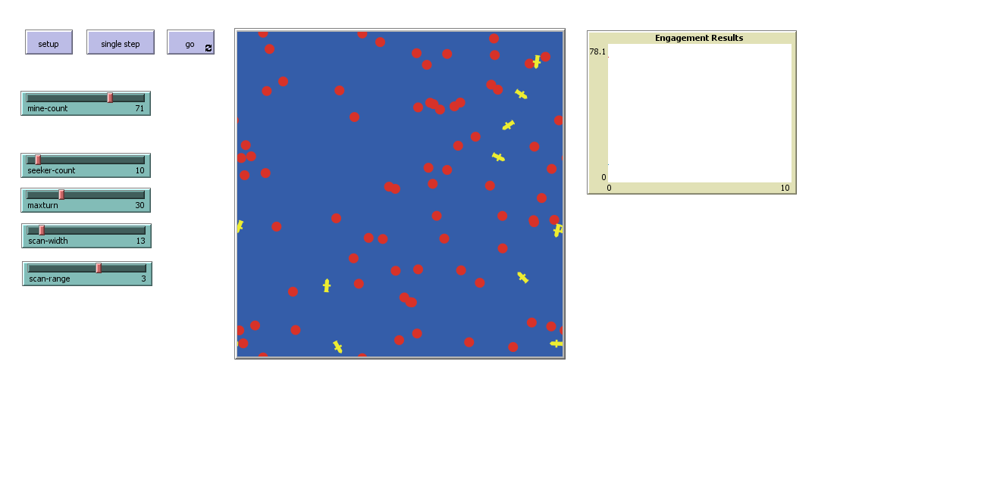

# netlogo-minehunter

This is a 2D simulation of a basic autonomous minehunting scenario.  A live demo is at [paulopperman.github.io/netlogo-minehunter/minefield-demo.html](https://paulopperman.github.io/netlogo-minehunter/minefield-demo.html).

Mines are randomly distributed throughout the world, and don’t move.  They explode when a seeker moves onto the mine’s patch, killing both the mine and the seeker. Mines can be neutralized by a seeker, in which case it won’t react anymore.

Seekers are vehicles that move randomly throughout the world. They can turn left or right up to a maximum angle each step. They are able to neutralize mines that are in a cone in front of them, with variable arc and range parameters.

## Setup

The model is written in [NetLogo](http://ccl.northwestern.edu/netlogo/) 6.0.2.
